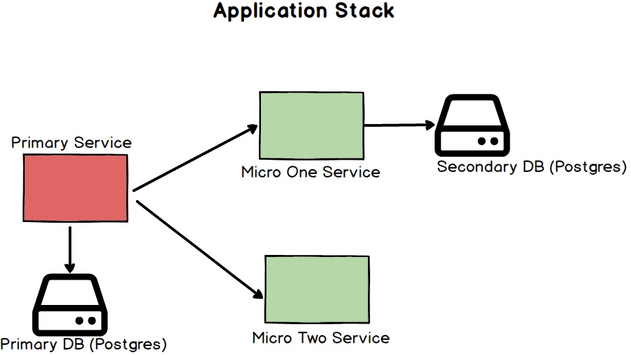

# Improving the Development Experience through Docker 

Reference implemention of the concepts discussed in the presentation - https://chitamoor.github.io/docker-dx/

## Basic concepts:

###Stack
An appliation stack typically has three components - 

   1. A **primary** service
   2. A DataStore e.g. Postgres DB (some services may not have a Datastore)
   3. Zero or more **secondary** services

All of the above components (services) run inside a Docker container.
There exists a separate **Dockerfile** for the **primary service** and the **DB service**.
All the dependent services are declared in the **docker-compose.yml** file.
Please see the [**Docker Setup** section](#docker-setup) for specific instructions on how to set up Docker

### <a name="lifecycle"></a>Service Lifecycle
Each of the application stack's components (primary service, DB service and dependent services) have one or more of the following lifecycle stages - 

* init (env)
* build (image)
* start/restart (contaniner)
* destroy  (contaniner and image)
 
## Getting Started with the Development workflow
In order to launch the application stack, you will need the docker images for the primary, DB and dependent services. You can only build the (docker) image for the primary service and the corresponding DB service from within a repo/project. The images of dependent services can either be pulled from the private repository or can be built locally from within the corresponding repo/project.


###devctl.sh
**devctl.sh** is the primary (bash) script that controls the developer environment, including the **lifecyle of the application stack**. The **devctl** script is found in the main directory of every project, and requires a few **environment variables** to be specified. These variables must be defined in the **env.sh** file which should also exist in the top level directory of the project. 

Examples of the variables that need to be defined in env.sh - 

```
	export SERVICE="docker_dx/xxx”
	export SERVICE_NAME=“xxx”
	export DB_SERVICE=${SERVICE}-db
	export DB_SERVICE_IMAGE=${SERVICE_IMAGE}-db
	export REGISTRY_URL=docker.*
```

##DevCtl commands

### Initialization commands 
```devctl.sh  init```
    
***init*** command calls the ***init.sh*** script if it exists. So, if your project needs any initialization/setup, you will have to define it in ```init.sh`` script in the top level directory of the project. 

###Primary service lifecycle commands
* **Build the primary service Image** - Creates the **Docker Image** needed for the primary service
  
  ```devctl.sh build-service```

  ___The build command only applies to the primary service___

  If you need to build the images of the dependent services, you will have to checkout the repo of the corresponding dependent service and build the images separately. You can alternatively, pulls the images from the **Private Registry** as well.
  The ***build*** command should be called any time you make changes to the source code or config changes

* **Start a Service**  - Start a service. See below for the list of [**Services**](#o2i-services)

  ```devctl.sh start-service <service_name>```
  
  	 ___If you don't specify a service, the primary service will be used___

 
* **Stop a Service** - Stop a service. See below for the list of [**O2I-Services**](#o2i-services)
   
  ```devctl.sh stop-service <service_name>```

  	 ___If you don't specify a service, the primary service will be used___

* **Restart a Service** - Restart a service. Look below for the list of service names. 

  ```devctl.sh restart-service <service_name>```
 
   	 ___If you don't specify a service, the primary service will be used___

### DB lifecycle commands
* **Build the DB Service Image** - Creates the Docker Image needed for the DB service
  
  ```devctl.sh build-db``` Please see the [**DB Setup**](#db-setup) section for further information

* **Start the DB Service**  - Start the DB service

  ```devctl.sh start-db ```

* **Stop the DB Service**  - Stop the DB service

	```devctl.sh stop-db ```

* **Restart the DB Service**  - Restart the DB service

  ```devctl.sh restart-db ```
 

### Application stack lifecycle commands
* **Launch Stack** - Start the primary service and all the dependent services

  ```devctl.sh start-stack```

- **Shutdown Stack** - Stop the primary service and all the dependent services

   ```devctl.sh stop-stack```

- **Restart Stack** - Re-start the primary service and all the dependent services

   ```devctl.sh restart-stack```

### Utility commands

- **Cleanup** -  Remove dangling images
  
  ```devctl cleanup```

- **Status** - Shows the status of the containers including exited containers

	```devctl status```

- **ps** - Shows the status of the running containers

	```devctl ps```

## <a name="o2i-services"></a>List of "Containarized" Services in this demo
___The specific properties for each of the service is defined in the "env.sh" file for each project___

### Primary Service
* Container/Primary-Service Name: ___primary_svc___
* DataBase Container/Service: ___primary_svc-db___
* DataBase Name : ___primary_svc___

### MicroOne Service
* Container/Primary-Service Name: ___micro_svc_one___
* DataBase Container/Service: ___micro_svc_one-db___
* DataBase Name : ___micro_svc_one___

### MicroTwo Service
* Container/Primary-Service Name: ___micro_svc_two___

## <a name="docker-setup"></a>Docker
### Docker Setup on Mac OSX

- [**Install Docker For Mac**](https://docs.docker.com/docker-for-mac/)

### Directory Structure:
- All of the Docker related files are in the top level ***docker*** folder inside every project.
- The **docker-compose.yml** file is in the **docker** directory
- There are two docker files - 
  -   One for the Application - ___docker/application/Dockerfile___
  -   One for the DB - ___docker/database/Dockerfile___ 

## The Demo Stack


## Steps to launch the demo stack

### 1. Build the images for the services
  You will have to run ``` devctl.sh build-service ``` for each of the services - **primary, micro_service_one and micro_service_two**

### 2. Build the images for the databases for the **primary** and **micro_one** services
  You will have to run ``` devctl.sh build-data ``` from within the - primary_service and micro_service_one directories  

### 3. Launch the Stack
  Run ``` devctl.sh start-stack ``` from inside the **primary_service** directory

### 4. Verify 
  Run ``` devctl.sh status ``` to verify if all the containers/services started properly

### 5. Check URLs
##### Primary Service Urls
- http://localhost:9000/api/primary/
- http://localhost:9000/api/primary/micro_one
- http://localhost:9000/api/primary/micro_one/resource/1
- http://localhost:9000/api/primary/micro_two

##### Micro One Service Urls
- http://localhost:9010/api/micro_one
- http://localhost:9000/api/micro_one/resource/1

##### Micro Two Service Urls
- http://localhost:9010/api/micro_two


## <a name="db-setup"></a>DB Setup
There exists a ***seed.sql*** file inside the ***docker/database*** directory. This file is generated through the ```generate_db_seed.sh``` script. The ```generate_db_seed.sh``` basically runs the **liquibase** definitions in the ***liquibase/seed*** and ***liquibase/migrations*** directories. 

```devctl.sh build-db``` command creates a **Postgres** Docker image and initializes it with the **seed.sql** file. 

